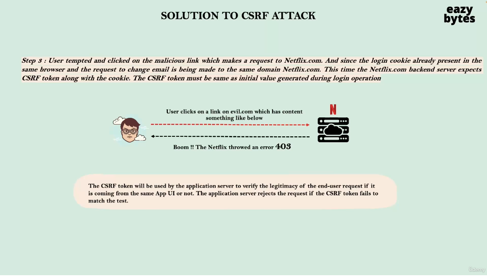
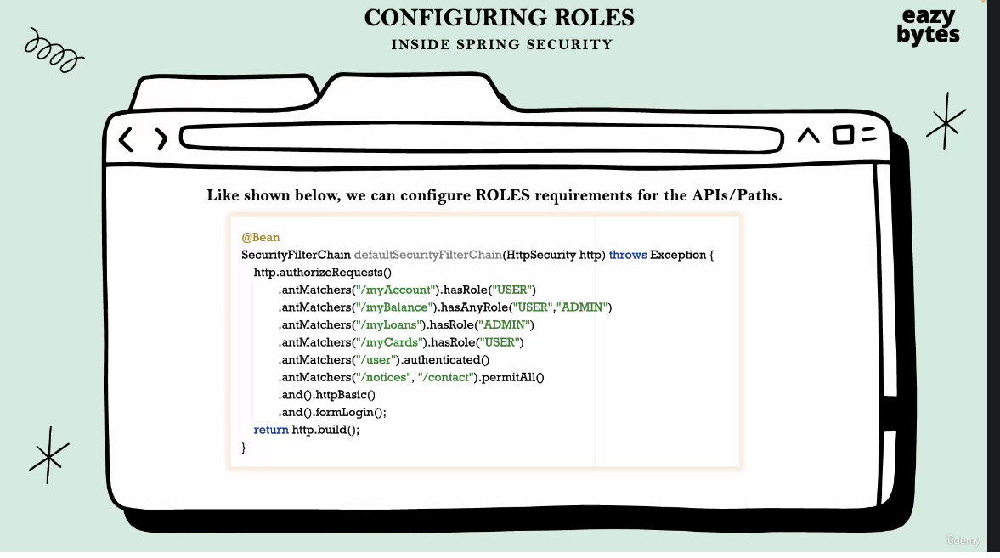

# Spring-Security

[For spring security zero to master](https://www.udemy.com/course/spring-security-zero-to-master/?src=sac&kw=spring+security+zero+to+master)

[Course github](https://github.com/eazybytes/springsecurity6)


# Section 1 Getting Started #

## Creating spring projects ##
can create a spring project at https://start.spring.io/
- most basic project uses spring web (web server default is tomcat), and dev tools
- can add in spring security for security starter

Diff with vs without spring security


### Adding Lombok ###
- for slf4j logging annotation 

```
    <dependency>
			<groupId>org.projectlombok</groupId>
			<artifactId>lombok</artifactId>
			<optional>true</optional>
		</dependency>
```

and exclude from the build 


```
  build>
		<plugins>
			<plugin>
				<groupId>org.springframework.boot</groupId>
				<artifactId>spring-boot-maven-plugin</artifactId>
				<configuration>
					<excludes>
						<exclude>
							<groupId>org.projectlombok</groupId>
							<artifactId>lombok</artifactId>
						</exclude>
					</excludes>
				</configuration>
			</plugin>
		</plugins>
  </build>

```

## Spring Security Out Of The Box ##
- as soon as you add the spring security dependency, without doing anything it will start intercepting calls 
- will show a login screen, user: ```user```, password is printed in the console

## 6 Static Credentials ##
[common application properties](https://docs.spring.io/spring-boot/docs/current/reference/html/application-properties.html)
[yaml vs properties files](https://www.baeldung.com/spring-boot-yaml-vs-properties)

```
spring.security.user.name=myuser
spring.security.user.password=testing
```

## 7 Why Use Spring Security ##
- app security is very complex
- always new exploits, frameworks update and patch known vulnerabilities
- spring security is built by security experts, allowing us to secure our app for with very minimal configuration
- open source
- protects against common exploits
- Supports RBAC
- Supports various types of auth, JWT, OAuth2, OpenID, Username and Password etc...

## 8 Servlets VS Filters ##


- servlet is created internally by spring 
- filter is used to intercept every request to the application
- acts a middleware in between client and servlet/business logic

## 9 Spring Security Architecture ##


1. user enters credentials
2. Filters create authentication object such as the ```UsernamePasswordAuthenticationToken```
3. Authentication object handed to the authentication manager
4. Authentication Manager, which is implemented by ```ProviderManager``` checks available authentication provider
5. Authentication Providers decide if user is valid
  - can be many authentication providers
  - can write logic in authentication providers to decide how to authenticate
  - Authentication manager will try all authentication providers, not just one
  - Can leverage spring security classes ```UserDetailsManager``` and ```UserDetailsService```
6. Encodes passwords as to not store in plain text
  - works with ```UserDetailsManager/Service``` to decide if the user should be authenticated
7. Sends response back to authentication manager
8. Forwards back to security filters
9. With an update Authentication Object, the filters store it in the security context
  - store authentication status, session id etc...
  - this is why user doesn't have to log in again
10. Final yes/no response sent back to end user


## 11 Spring Security Sequence Flow ##


## Annotations ##

```
@ComponentScan("com.eazybytes.sprinsecuritybasic.controller") 
```
- sprinsecuritybasic/src/main/java/com/eazybytes/sprinsecuritybasic/SprinsecuritybasicApplication.java

- optional in this setup as spring scans components in THIS and sub packages, however if we split our app out into a package outside springsecruitybasic then would need to annotate


# Section 2 Default Security Configurations #

## 17 Default Spring Security Configuration ##
- spring security protects all paths by default 
- this is configured in the ```defaultSecurityFilterChain``` bean


- ```http.authorizeRequests().anyRequest().authenticated();``` - says authorize any request made to the backend 

- from the comments 

```
The default configuration for web security. It relies on Spring Security's content-negotiation strategy to determine what sort of authentication to use. ** If the user specifies their own SecurityFilterChain bean, this will back-off completely and the users should specify all the bits that they want to configure as part of the custom security configuration **.
```
- if we create a bean of securityFilter chain then our custom auth will be taking place


## 18 Adding Custom Authentication Configuration ##
- can permit all or choose which paths need authentication

- see ./02_section/sprinsecuritysec2/src/main/java/com/eazybytes/config/ProjectSecurityConfig.java

## 19 Denying All Requests ##
- could deny all if they want
- could do this to either test security, go through updates or turn off the services for a period of time 


```
    @Bean
    SecurityFilterChain defaultSecurityFilterChain(HttpSecurity http) throws Exception {
        http.authorizeHttpRequests().anyRequest().denyAll();
        http.formLogin();
        http.httpBasic();
        return http.build();
    }
```

## 20 Allowing All Requests ##

- could allow all requests
- could be done for development environments via conditional beans 


```
    @Bean
    SecurityFilterChain defaultSecurityFilterChain(HttpSecurity http) throws Exception {
        http.authorizeHttpRequests().anyRequest().permitAll();
        http.formLogin();
        http.httpBasic();
        return http.build();
    }
```

# Section 3 Defining and Managing Users #
## 22 Approach 1 Configuring users using inMemoryUserDetailsManager ##
- not for production
- can define multiple users along with their authorities with the help fo ```inMemoryUserDetailsManager``` and ```UserDetails```
- use the ```withDefaultPasswordEncoder()``` method, this method is deprecated


## 23 Approach 2 Configuring users using inMemoryUserDetailsManager ##
- not for production
- here we create a bean of password encoder


## 24 Understanding User Management Interfaces and Classes ## 


- the ```DaoAuthenticationProvider``` that comes with spring will look to user the ```inMemoryUserDetailsManager```, ```JdbcUserDetailsManager``` and ```LdapUserDetailsManager``` 
- the details managers are sample implementations provided by spring security
- The ```UserDetails``` interface allows us to represent the User as a ```User``` class that implements the ```UserDetails```
- When you return a new class of type ```...UserDetailsManager```, the ```loadUserByUsername``` method is called
  - this method returns ```UserDetails``` which implements ```UserDetailsManager ``` which extends ```UserDetailsService```

## 25 Deep Dive of UserDetails Interface and User Class ##
- holds methods for 
  1. getAuthorities()
  2. getPassword()
  3. getUsername()
  4. isAccountNonExpired()
  5. isAccountNonLocked()
  6. isCredentialsNonExpired()
  7. isEnabled()

- sample of this interface are the ```User``` Class, we can use this or implement our own ```userDetails```

- this object is readOnly, there are not setters, once the object is created through the constructor it is immutable
- 


- identify if authentication is successful or not inside the authentication providers
- ```AuthenticationProvider``` will convert the userDetails into the Authentication Token, after fetched from the database and authenticated
- this is done by default in the ```AbstractUserDetailsAuthenticationProvider.java```,  ```authenticate``` method, if authenticated then it called the ```createSuccessAuthentication``` method witch takes in an auth token, user and returns back a populated authentication token

## 26 Deep Dive of UserDetailsService and UserDetailsManager ##
- ```UserDetailsService```, holds the method ```loadUserByUsername``` which loads the user from the database
- only username is loaded, not the password, which we dont want to move over the network
- ```UserDetailsService```is extended by the ```UserDetailsManager``` which gives the ability to perform CRUD operations on users
   - offers a userExists() method that tells if that user already exists in the system

## 27 Deep Dive of UserDetailsManager implementation classes ##
- ```inMemoryUserDetailsManager```, ```JdbcUserDetailsManager``` and ```LdapUserDetailsManager```  are the most commonly used and examples are provided by spring


### inMemoryUserDetailsManager ###

- for ```inMemoryUserDetailsManager``` the ```createUser()``` method is called through the constructor 
- holds the ```loadUserByUsername()``` method 
- ```DaoAuthenticationProvider``` knows which details manager to invoke by which beans are created 
- ```inMemoryUserDetailsManager``` used mostly for dev and demo

### JdbcUserDetailsManager ###
- most common for production 
- spring security assumes a specific table structure, they have programmed queries for this configuration 
- table name must be ```users```
- there is a default schema included in the class, pointing to a ddl file. 
- can use the ```users.ddl``` file to create the database architecture


### Group Manager ###
- interface
- implemented by ```JdbcUserDetailsManager```
- helps create and add users to groups for RBAC


### LdapUserDetailsManager ###
- not as common
- still has ```loadUserByUserName```
- have to have an LDAP server configured

### Adding LDAP ###
- add following dependencies 

```
    <dependency>
			<groupId>org.springframework.ldap</groupId>
			<artifactId>spring-ldap-core</artifactId>
		</dependency>
		<dependency>
			<groupId>org.springframework.security</groupId>
			<artifactId>spring-security-ldap</artifactId>
		</dependency>
```

## 28 Creating MySQL DB ##


- can just do this in docker 

``` docker pull mysql```

```docker run --name spring-security-mysql -p 3306:3306 -e MYSQL_ROOT_PASSWORD=pwd -e useSSL=false -d mysql```

### Connecting with DBeaver ###
- host = localhost
- username = root
- pwd = pwd
- port = 3306 
- go to driver properties -> set ```allowPublicKeyRetrieval``` to true
- https://stackoverflow.com/questions/61749304/connection-between-dbeaver-mysql

## 29 Connecting to DB ##

- have to create and seed the database

```
create database eazybank;

use eazybank;

CREATE TABLE `users` (
`id` INT NOT NULL AUTO_INCREMENT,
`username` VARCHAR(45) NOT NULL,
`password` VARCHAR(45) NOT NULL,
`enabled` INT NOT NULL,
PRIMARY KEY (`id`));

CREATE TABLE `authorities` (
  `id` int NOT NULL AUTO_INCREMENT,
  `username` varchar(45) NOT NULL,
  `authority` varchar(45) NOT NULL,
  PRIMARY KEY (`id`));

INSERT IGNORE INTO `users` VALUES (NULL, 'happy', '12345', '1');
INSERT IGNORE INTO `authorities` VALUES (NULL, 'happy', 'write');

CREATE TABLE `customer` (
  `id` int NOT NULL AUTO_INCREMENT,
  `email` varchar(45) NOT NULL,
  `pwd` varchar(200) NOT NULL,
  `role` varchar(45) NOT NULL,
  PRIMARY KEY (`id`)
);

INSERT INTO `customer` (`email`, `pwd`, `role`)
 VALUES ('t@t.com', '54321', 'admin');

```

- can be used for small or flexible projects but example tables might not be usable for everyone

## 30 Using JdbcUserDetailsManager ##

- have to add dependencies for spring jdbc, mysql and spring data jpa

```
    <dependency>
			<groupId>org.springframework.boot</groupId>
			<artifactId>spring-boot-starter-jdbc</artifactId>
		</dependency>
		<dependency>
			<groupId>com.mysql</groupId>
			<artifactId>mysql-connector-j</artifactId>
			<scope>runtime</scope>
		</dependency>
		<dependency>
			<groupId>org.springframework.boot</groupId>
			<artifactId>spring-boot-starter-data-jpa</artifactId>
		</dependency>
```


- connect with 

```
# dont inject like this in production, should come from devops team
spring.datasource.url=jdbc:mysql://localhost/eazybank
spring.datasource.username=root
spring.datasource.password=pwd


#print sql in the console, not for production
spring.jpa.show-sql=true
spring.jpa.properties.hibernate.format_sql=true
```

- will then create the JdbcUserDetailsManager

```
    @Bean
    public UserDetailsService userDetailsService(DataSource dataSource){
        return new JdbcUserDetailsManager(dataSource);
    }

```

- Spring boot creates an object of type data source in memory when we add jbdc information to class path and application properties

- can have multiple ```UserDetailsManagers``` if have multiple ```AuthenticationProviders```


## 31 Creating Custom Authentication Tables ##
- in schema above
- will have to create your own JPA entity, wont be able to sue the default one

## 32 Creating JPA Entity and Repo for new table ##
- have to create a repository
```
sprinsecuritysec3/src/main/java/com/eazybytes/repository/CustomerRepository.java
```
- have to create a model
```
sprinsecuritysec3/src/main/java/com/eazybytes/model/Customer.java
```

### Annotations ###
- have to add 2 annotations to spring application if repositories or entities are not in the main package
- will scan and create beans for the packages

```
@EnableJpaRepositories("com.eazybytes.repository")
@EntityScan("com.eazybytes.model")
```

- if not using the spring security starter must have annotation to turn on web security

```
@EnableWebSecurity
```

## 33 Create custom implementation of userDetailsService ##
- if we are using our own database setup, we must override the default ```UserDetailsService``` and write logic for loading the user in the ```loadUserByUsername``` method

- sprinsecuritysec3/src/main/java/com/eazybytes/config/EazyBankUserDetails.java

### multiple userDetailsService ###
- if you have ```userDetailsService``` it will confuse the ```DaoAuthenticationProvider```

## 34 Allowing new user registration ##
- Could override the ```UserDetailsManager``` ```createUser() ``` method 
- see for example sprinsecuritysec3/src/main/java/com/eazybytes/controller/LoginController.java
- have to permit non authenticated users to hit the /register path
- this point can create with postman
```
{
    "email": "1@1.com",
    "pwd": "12345",
    "role": "user"
}
```

- successful response will be ```Given user details are successfully registered```

## Update Sequence with custom  JBDC User Details Service ##


# Section 4 Password Management and Encoders#


## 35 How are passwords validated in spring security by default ##
- default password encoder uses plain text


- ```AbstractUserDetailsAuthenticationProvider``` - ```authenticate()``` method 
- runs some ```preAuthenticationChecks()``` such as checking for disabled, expired etc
- then runs ```DaoAuthenticationProvider``` - ```additionalAuthenticationChecks()```
   - ```additionalAuthenticationChecks()``` calls the ```matches()``` method defined in every password encoder 
   - ```matches``` takes in the password the user typed and the password loaded from the database
   - if passwords match you are authenticated
   - if not ```BadCredentialsException``` is thrown

### NoOpPasswordEncoder ###
- default password encoder
- doesn't actually encode anything
- stores passwords in plain text
- not for production


## 36 Encoding vs Encryption vs Hashing part 1 ##


## 37 Encoding vs Encryption vs Hashing part 2 ##


## 38 How to validate passwords with hashing and password encoders ##

- password encoders take care of comparing hash strings

## 39 PasswordEncoder Interface ##
- includes:
1. encode - will put password through corresponding hash/encryption (even it that is none)
2. matches (true if the same, ie good login)
3. upgradeEncoding - can encode your password two times, default is false


## 40 Password Encoder Implementation Classes part 1 ##

- not for production

### NoOpPasswordEncoder ###
- default password encoder
- doesn't actually encode anything
- stores passwords in plain text
- not for production, only demo/dev

### StandardPasswordEncoder ###
- not for production
- deprecated
- only implemented to support legacy applications 
- sha-256, 1024 iterations and random 8-byte salt

### Pbkdf2PasswordEncoder ###
- can use but not recommended
- has become less secure over last few years
- susceptible to brute force attacks

## 41 Password Encoder Implementation Classes part 2 ##

- can use in production
- should have strong password requirements, ie: 8 Chars, letters, numbers and special characters
- strong password requirements make brute force nearly impossible with any of the following 3 passwordEncoders


### BCryptPasswordEncoder ###
- uses Bcrypt hashing algorithm
- continually updated based on hardware and best practices
- utilizes more cpu/resources
- less susceptible to brute force
- secure
- most commonly used 


### SCryptPasswordEncoder ###
- advance version of ```BCryptPasswordEncoder```
- uses both cpu and ram
- make brute force tougher due to resource restriction
- more secure
### Argon2PasswordEncoder ###
- newest based on latest hashing algorithm 
- uses both cpu, ram and multiple threads
- make brute force tougher due to resource restriction
- also can slow down our application due to resource needs
- most secure

## 42 Register New User With ByCrypt Password Encoder ##
- create a passwordEncoder bean with the ```BCryptPasswordEncoder```

```
    @Bean
    public PasswordEncoder passwordEncoder(){

      return new BCryptPasswordEncoder();
    }
```

- has passwords now when the creating an new user ex: 04_section/sprinsecuritysec4/src/main/java/com/eazybytes/controller/LoginController.java

- by default does 10 rounds of hashing but this can be configured
- could change options if wanted to utilizing different constructors of ```BCryptPasswordEncoder```
- min rounds is 4, max is 31, default is 10
- could pass a salt if we had one 

- from javadoc of ```BCryptPasswordEncoder```

```
Implementation of PasswordEncoder that uses the BCrypt strong hashing function. Clients can optionally supply a "version" ($2a, $2b, $2y) and a "strength" (a.k.a. log rounds in BCrypt) and a SecureRandom instance. The larger the strength parameter the more work will have to be done (exponentially) to hash the passwords. The default value is 10.
```

- see difference ins stored passwords


- plain text passwords will no longer with when ```BCryptPasswordEncoder``` is enabled
- ```BCryptPasswordEncoder``` knows this is not a BCrypt encoded password

- will give error in console

```
2023-01-03T17:37:21.975-05:00  WARN 54197 --- [nio-8888-exec-7] o.s.s.c.bcrypt.BCryptPasswordEncoder     : Encoded password does not look like BCrypt
```

## 43 Login With ByCrypt Password Encoder ##
- if using the default ```DaoAuthenticationProvider``` then no additional configuration is needed. ```DaoAuthenticationProvider```  will handle calling functions for password comparison 

- could define your own password encoder by implementing PasswordEncoder interface but not recommended

# Section 5 Authentication Providers #

## 44 Why create our own authentication provider ##
- the default authentication provider is ```DaoAuthenticationProvider```
- this is a flexible class that allows us to change ```UserDetailsService``` as well as ```PasswordEncoder```, however it does not support all use cases
- we may want to create our own authentication logic ie: only allowed age or countries
- may want multiple authentication providers


## 45 Authentication Provider methods ##
- ```authenticate()``` method actually kicks off the authenticate process
   - returns an authentication token with a user that is either authenticated or not
- ```supports()``` - tells which type of authentication objects are supported
   - called inside the ```ProviderManager```, which implements the ```AuthenticationManager``` interface, to check if the current authenticationProvider supports the type of authenticationToken that is passed in

- ```DaoAuthenticationProvider``` supports ``````UsernamePasswordAuthenticationToken``` out of the box

- other auth tokens provided by spring
1. ```TestingAuthenticationToken```
2. ```AnonymousAuthenticationToken```
3. ```RememberMeAuthenticationToken```


## 46 Implementing Custom Authentication Provider ##
- since we created our own custom AuthenticationProvider, we no longer need a userDetailsService. If wa wanted to make our custom AuthenticationProvider depend on a userDetailsService, like the default ```DaoAuthenticationProvider``` then we could use on, but not necessary as this logic is now in our ```EazyBankUsernamePwdAuthenticationProvider```, which is talking directly to the CrudRepository via DI


- example : sprinsecuritysec5/src/main/java/com/eazybytes/config/EazyBankUsernamePwdAuthenticationProvider.java

## 47 Testing our Custom Authentication Provider ##
- ```EazyBankUsernamePwdAuthenticationProvider.authenticate()``` is called by the spring security ```ProviderManager```
- after authentication is completed based on logic in the ```authenticate()``` method  the ```ProviderManager``` does some cleanup including deleting the credentials we were comparing against
- can also have an event published (an use this to send a push notification/email)

## 48 Spring Security Sequence Flow with Custom AuthenticationProvider ##

```Provider Manager``` implements ```AuthenticationManager```, they are interchangeable


- SpringSecurityFilter and ```AuthenticationManager``` do their own job, we do not override those
- we changed the authenticationProvider and its methods (which are called by the ```AuthenticationManager```), incorporating the database call into our custom ```EazyBankUsernamePwdAuthenticationProvider```. Since we were no longer user the default ```DaoAuthenticationProvider```, we did not need a ```UserDetailsService```/ ```UserDetailsManager```

- Also overrode the ```PasswordEncoder``` to use the ```BCryptPasswordEncoder```


# Section 6 #

- Starting in this section we will start using the Angular UI to talk to our backend

## 49 Setting up Separate UI ## ##
- directions for setting up are ./angular_ui/bank-app-ui/README.md

## 51 Creating new DB for schema ##

- run the following schema 

```
use eazybank;

drop table `users`;
drop table `authorities`;
drop table `customer`;
drop table accounts;

CREATE TABLE `customer` (
  `customer_id` int NOT NULL AUTO_INCREMENT,
  `name` varchar(100) NOT NULL,
  `email` varchar(100) NOT NULL,
  `mobile_number` varchar(20) NOT NULL,
  `pwd` varchar(500) NOT NULL,
  `role` varchar(100) NOT NULL,
  `create_dt` date DEFAULT NULL,
  PRIMARY KEY (`customer_id`)
);

INSERT INTO `customer` (`name`,`email`,`mobile_number`, `pwd`, `role`,`create_dt`)
 VALUES ('Happy','happy@example.com','9876548337', '$2y$12$oRRbkNfwuR8ug4MlzH5FOeui.//1mkd.RsOAJMbykTSupVy.x/vb2', 'admin',CURDATE());

CREATE TABLE `accounts` (
  `customer_id` int NOT NULL,
  `account_number` int NOT NULL,
  `account_type` varchar(100) NOT NULL,
  `branch_address` varchar(200) NOT NULL,
  `create_dt` date DEFAULT NULL,
  PRIMARY KEY (`account_number`),
  KEY `customer_id` (`customer_id`),
  CONSTRAINT `customer_ibfk_1` FOREIGN KEY (`customer_id`) REFERENCES `customer` (`customer_id`) ON DELETE CASCADE
);

INSERT INTO `accounts` (`customer_id`, `account_number`, `account_type`, `branch_address`, `create_dt`)
 VALUES (1, 18657645, 'Savings', '123 Main Street, New York', CURDATE());

CREATE TABLE `account_transactions` (
  `transaction_id` varchar(200) NOT NULL,
  `account_number` int NOT NULL,
  `customer_id` int NOT NULL,
  `transaction_dt` date NOT NULL,
  `transaction_summary` varchar(200) NOT NULL,
  `transaction_type` varchar(100) NOT NULL,
  `transaction_amt` int NOT NULL,
  `closing_balance` int NOT NULL,
  `create_dt` date DEFAULT NULL,
  PRIMARY KEY (`transaction_id`),
  KEY `customer_id` (`customer_id`),
  KEY `account_number` (`account_number`),
  CONSTRAINT `accounts_ibfk_2` FOREIGN KEY (`account_number`) REFERENCES `accounts` (`account_number`) ON DELETE CASCADE,
  CONSTRAINT `acct_user_ibfk_1` FOREIGN KEY (`customer_id`) REFERENCES `customer` (`customer_id`) ON DELETE CASCADE
);


INSERT INTO `account_transactions` (`transaction_id`, `account_number`, `customer_id`, `transaction_dt`, `transaction_summary`, `transaction_type`,`transaction_amt`,
`closing_balance`, `create_dt`)  VALUES (UUID(), 18657645, 1, "2022-12-24", 'Coffee Shop', 'Withdrawal', 30,34500, "2022-12-24");

INSERT INTO `account_transactions` (`transaction_id`, `account_number`, `customer_id`, `transaction_dt`, `transaction_summary`, `transaction_type`,`transaction_amt`,
`closing_balance`, `create_dt`)  VALUES (UUID(), 18657645, 1, "2022-12-25", 'Uber', 'Withdrawal', 100,34400,"2022-12-25");

INSERT INTO `account_transactions` (`transaction_id`, `account_number`, `customer_id`, `transaction_dt`, `transaction_summary`, `transaction_type`,`transaction_amt`,
`closing_balance`, `create_dt`)  VALUES (UUID(), 18657645, 1, "2022-12-26", 'Self Deposit', 'Deposit', 500,34900,"2022-12-26");

INSERT INTO `account_transactions` (`transaction_id`, `account_number`, `customer_id`, `transaction_dt`, `transaction_summary`, `transaction_type`,`transaction_amt`,
`closing_balance`, `create_dt`)  VALUES (UUID(), 18657645, 1, "2022-12-27", 'Ebay', 'Withdrawal', 600,34300,"2022-12-27");

INSERT INTO `account_transactions` (`transaction_id`, `account_number`, `customer_id`, `transaction_dt`, `transaction_summary`, `transaction_type`,`transaction_amt`,
`closing_balance`, `create_dt`)  VALUES (UUID(), 18657645, 1, "2022-12-28", 'OnlineTransfer', 'Deposit', 700,35000,"2022-12-28");

INSERT INTO `account_transactions` (`transaction_id`, `account_number`, `customer_id`, `transaction_dt`, `transaction_summary`, `transaction_type`,`transaction_amt`,
`closing_balance`, `create_dt`)  VALUES (UUID(), 18657645, 1, "2022-12-29", 'Amazon.com', 'Withdrawal', 100,34900,"2022-12-29");


CREATE TABLE `loans` (
  `loan_number` int NOT NULL AUTO_INCREMENT,
  `customer_id` int NOT NULL,
  `start_dt` date NOT NULL,
  `loan_type` varchar(100) NOT NULL,
  `total_loan` int NOT NULL,
  `amount_paid` int NOT NULL,
  `outstanding_amount` int NOT NULL,
  `create_dt` date DEFAULT NULL,
  PRIMARY KEY (`loan_number`),
  KEY `customer_id` (`customer_id`),
  CONSTRAINT `loan_customer_ibfk_1` FOREIGN KEY (`customer_id`) REFERENCES `customer` (`customer_id`) ON DELETE CASCADE
);

INSERT INTO `loans` ( `customer_id`, `start_dt`, `loan_type`, `total_loan`, `amount_paid`, `outstanding_amount`, `create_dt`)
 VALUES ( 1, '2020-10-13', 'Home', 200000, 50000, 150000, '2020-10-13');

INSERT INTO `loans` ( `customer_id`, `start_dt`, `loan_type`, `total_loan`, `amount_paid`, `outstanding_amount`, `create_dt`)
 VALUES ( 1, '2020-06-06', 'Vehicle', 40000, 10000, 30000, '2020-06-06');

INSERT INTO `loans` ( `customer_id`, `start_dt`, `loan_type`, `total_loan`, `amount_paid`, `outstanding_amount`, `create_dt`)
 VALUES ( 1, '2018-02-14', 'Home', 50000, 10000, 40000, '2018-02-14');

INSERT INTO `loans` ( `customer_id`, `start_dt`, `loan_type`, `total_loan`, `amount_paid`, `outstanding_amount`, `create_dt`)
 VALUES ( 1, '2018-02-14', 'Personal', 10000, 3500, 6500, '2018-02-14');

CREATE TABLE `cards` (
  `card_id` int NOT NULL AUTO_INCREMENT,
  `card_number` varchar(100) NOT NULL,
  `customer_id` int NOT NULL,
  `card_type` varchar(100) NOT NULL,
  `total_limit` int NOT NULL,
  `amount_used` int NOT NULL,
  `available_amount` int NOT NULL,
  `create_dt` date DEFAULT NULL,
  PRIMARY KEY (`card_id`),
  KEY `customer_id` (`customer_id`),
  CONSTRAINT `card_customer_ibfk_1` FOREIGN KEY (`customer_id`) REFERENCES `customer` (`customer_id`) ON DELETE CASCADE
);

INSERT INTO `cards` (`card_number`, `customer_id`, `card_type`, `total_limit`, `amount_used`, `available_amount`, `create_dt`)
 VALUES ('4565XXXX4656', 1, 'Credit', 10000, 500, 9500, "2022-12-31");

INSERT INTO `cards` (`card_number`, `customer_id`, `card_type`, `total_limit`, `amount_used`, `available_amount`, `create_dt`)
 VALUES ('3455XXXX8673', 1, 'Credit', 7500, 600, 6900, "2022-12-31");

INSERT INTO `cards` (`card_number`, `customer_id`, `card_type`, `total_limit`, `amount_used`, `available_amount`, `create_dt`)
 VALUES ('2359XXXX9346', 1, 'Credit', 20000, 4000, 16000, "2022-12-31");

CREATE TABLE `notice_details` (
  `notice_id` int NOT NULL AUTO_INCREMENT,
  `notice_summary` varchar(200) NOT NULL,
  `notice_details` varchar(500) NOT NULL,
  `notic_beg_dt` date NOT NULL,
  `notic_end_dt` date DEFAULT NULL,
  `create_dt` date DEFAULT NULL,
  `update_dt` date DEFAULT NULL,
  PRIMARY KEY (`notice_id`)
);

INSERT INTO `notice_details` ( `notice_summary`, `notice_details`, `notic_beg_dt`, `notic_end_dt`, `create_dt`, `update_dt`)
VALUES ('Home Loan Interest rates reduced', 'Home loan interest rates are reduced as per the goverment guidelines. The updated rates will be effective immediately',
CURDATE() - INTERVAL 30 DAY, CURDATE() + INTERVAL 30 DAY, CURDATE(), null);

INSERT INTO `notice_details` ( `notice_summary`, `notice_details`, `notic_beg_dt`, `notic_end_dt`, `create_dt`, `update_dt`)
VALUES ('Net Banking Offers', 'Customers who will opt for Internet banking while opening a saving account will get a $50 amazon voucher',
CURDATE() - INTERVAL 30 DAY, CURDATE() + INTERVAL 30 DAY, CURDATE(), null);

INSERT INTO `notice_details` ( `notice_summary`, `notice_details`, `notic_beg_dt`, `notic_end_dt`, `create_dt`, `update_dt`)
VALUES ('Mobile App Downtime', 'The mobile application of the EazyBank will be down from 2AM-5AM on 12/05/2020 due to maintenance activities',
CURDATE() - INTERVAL 30 DAY, CURDATE() + INTERVAL 30 DAY, CURDATE(), null);

INSERT INTO `notice_details` ( `notice_summary`, `notice_details`, `notic_beg_dt`, `notic_end_dt`, `create_dt`, `update_dt`)
VALUES ('E Auction notice', 'There will be a e-auction on 12/08/2020 on the Bank website for all the stubborn arrears.Interested parties can participate in the e-auction',
CURDATE() - INTERVAL 30 DAY, CURDATE() + INTERVAL 30 DAY, CURDATE(), null);

INSERT INTO `notice_details` ( `notice_summary`, `notice_details`, `notic_beg_dt`, `notic_end_dt`, `create_dt`, `update_dt`)
VALUES ('Launch of Millennia Cards', 'Millennia Credit Cards are launched for the premium customers of EazyBank. With these cards, you will get 5% cashback for each purchase',
CURDATE() - INTERVAL 30 DAY, CURDATE() + INTERVAL 30 DAY, CURDATE(), null);

INSERT INTO `notice_details` ( `notice_summary`, `notice_details`, `notic_beg_dt`, `notic_end_dt`, `create_dt`, `update_dt`)
VALUES ('COVID-19 Insurance', 'EazyBank launched an insurance policy which will cover COVID-19 expenses. Please reach out to the branch for more details',
CURDATE() - INTERVAL 30 DAY, CURDATE() + INTERVAL 30 DAY, CURDATE(), null);

CREATE TABLE `contact_messages` (
  `contact_id` varchar(50) NOT NULL,
  `contact_name` varchar(50) NOT NULL,
  `contact_email` varchar(100) NOT NULL,
  `subject` varchar(500) NOT NULL,
  `message` varchar(2000) NOT NULL,
  `create_dt` date DEFAULT NULL,
  PRIMARY KEY (`contact_id`)
);
```

- other scripts to create account number for other users
```
INSERT INTO `accounts` (`customer_id`, `account_number`, `account_type`, `branch_address`, `create_dt`)
VALUES (2, 123456, 'Savings', '123 Main Street, New York', CURDATE());
```


## 53 creating a new user with postman ##

- can post to ```localhost:8888/register```
```
{
    "name": "John Doe",
    "email": "1@1.com",
    "mobileNumber": "1234567890",
    "pwd": "12345",
    "role": "user"
}
```

- there is a sign up link in the UI but it is not configured

## 54 Cors Error ##
- Cross Origin Resource Sharing
- when making requests across origin


## 55 Introduction to Cors ##

- have to configure if we want to talk cross origin
- default is to block this 

## 56 Options to Fix Cors ##


- The browser sends a preflight request to the server and this is where origin data is communicated
- can use the ```@CrossOrigin``` annotation
- could explicitly configure it to an endpoint or to '*'
- It may not be feasible to do this for every single controller in an application

- can configure globally using spring security instead inside the defaultSecurityChain


## 57 Fixing Cors Using Spring Security ##
- configuration is fed into HttpSecurity 
- can see configuration: sprinsecuritysec6/src/main/java/com/eazybytes/config/ProjectSecurityConfig.java


## 58 Demo of CSRF Protection from Spring Security ## 
- Cross Site Request Forgery
- Spring security blocks updates to post/put operations that update data by default 
- could turn it off with ```http().csrf().disable()``` , not for production

- if this is on and not configured and posts will get a 401, have to explicitly say who is allowed to post/put

## 59 Example CSRF Attack ##
- also known as XSRF


## 60 Solutions for CSRF Attacks ##
- using a secondary secure CSRF token that is injected in a header by the app, to ensure th request is not being forged



## 61 Ignoring CSRF Protection For Public API endpoints ## ##
- can use to expose certain public endpoints beyond csrf protection

```
csrf().ignoringRequestMatchers("/contact", "/register")
```
- use to be ```ignoreAntMatchers()```
## 62 Implementing CSRF Token Solution ##
- by default spring ```CookieCsrfTokenRepository``` will create a token with the name ```XSRF-TOKEN```

### Part 1 - Backend ###
- sprinsecuritysec6/src/main/java/com/eazybytes/config/ProjectSecurityConfig.java
```
...
//-------------------- CSRF--------------------------
                //tell spring security these are public apis, but will protect all other endpoints
                //csrf process against malicious posts/puts so don't need notices as it only gets
                .csrf().ignoringRequestMatchers("/contact", "/register")

                // create a CSRF token and send it as a cookie,  and with withHttpOnlyFalse(), it allows the UI to read the cookie via JavaScript
                .csrfTokenRepository(CookieCsrfTokenRepository.withHttpOnlyFalse())
                //filter responsible for injecting the cookie
                .and().addFilterAfter(new CsrfCookieFilter(), BasicAuthenticationFilter.class)

...
```

- due to updates in spring security have to include a once pre request filter in order to continually append the CSRF cookie in the request/response headers

### Part 2 - Frontend ###
- have to handle reading and return the cookie in javascript on the frontend
- angular_ui/bank-app-ui/src/app/components/login/login.component.ts

```
validateUser(loginForm: NgForm) {
    this.loginService.validateLoginDetails(this.model).subscribe(
      responseData => {
        this.model = <any> responseData.body;
        this.model.authStatus = 'AUTH';
        window.sessionStorage.setItem("userdetails",JSON.stringify(this.model));
        // get the cookie and store is in session storage
        let xsrf = getCookie('XSRF-TOKEN')!;
        window.sessionStorage.setItem("XSRF-TOKEN",xsrf);
        this.router.navigate(['dashboard']);
      });

  }
```
- retrieve the cookie and set it in session storage 
- angular_ui/bank-app-ui/src/app/interceptors/app.request.interceptor.ts
```
    //get the token from session storage and put it in the headers
    let xsrf = sessionStorage.getItem('XSRF-TOKEN');
    if(xsrf){
      httpHeaders = httpHeaders.append('X-XSRF-TOKEN', xsrf);  
    }
```

### Basic Authentication ##
- with this configuration we now go through the ```BasicAuthenticationFilter``` as we post authentication to the ```/user``` endpoint
- the ```BasicAuthenticationFilter``` calls the ```ProviderManager``` which calls the ```EazyBankUsernamePwdAuthenticationProvider.autheenticat()``` method, this fetches the user and does the authentication by calling ```PasswordEncoder.matches()``` method, if it does match thn the ```UsernamePasswordAuthenticationToken``` is called constructor which creates the auth token and authenticated to true
- the authentication information is encoded on a ```Authorization Basic:``` header
- this is not recommend for production apps as the username and password are not encrypted on the header, they only exist in as base 64

# Section 7 Authorization #
## 64 Authentication vs Authorization ##


## 65 How Authorities are Stored in Spring Security ##


- authorities are passed to ```UsernamePasswordAuthenticationToken``` upon creation as an unmodifiable list
- authorities and roles are very similar and used to create ```GrantedAuthorities```


## 66 Creating new table Authorities to store multiple roles or authorities ##
- create an authorities table and use the id as a foreign key for the user
- see ./database_seed.sql

## 67 Backend Changes To Load Authorities ##
- have to create a new entity authority to account for new table in db
- have to map authority model, manyToOne and customer model
- this will pull authorities based on primary/foreign key from the db and map them to the customer object upon request of the customer


## 68 and 69 Configure Authorities Inside App Using Spring Security ## 

- sprinsecuritysec7/src/main/java/com/eazybytes/config/ProjectSecurityConfig.java


- ```hasAuthority``` - have to have the exact authority
- ```hasAnyAuthority```, if they have any of the acceptable ones
- if neither of above options work use ```access()``` which allows us to configure using spring expression language


- can invoke after ```requestMatchers```
- ```requestMatchers``` replaced ```antMatchers``` in spring v 3

- see example 

```
          http.
          ...     
                .authorizeHttpRequests()

                // performing RBAC with authorities
                .requestMatchers("/myAccount").hasAuthority("VIEWACCOUNT")
                .requestMatchers("/myBalance").hasAnyAuthority("VIEWACCOUNT","VIEWBALANCE")
                .requestMatchers("/myLoans").hasAuthority("VIEWLOANS")
                .requestMatchers("/myCards").hasAuthority("VIEWCARDS")
                //secure these paths so only authenticated users can access
                .requestMatchers( "/user").authenticated()
                //allow anyone to see this
                .requestMatchers("/notices", "/contact", "/register").permitAll();
      ...
        return http.build();

```

### Session ManageMent ###
- as of spring boot 3 and security 6 we now need to explicitly tell spring to always create new sessions 
- this will create a new session each time the user logs in

```
                .and().sessionManagement(session -> session.sessionCreationPolicy(SessionCreationPolicy.ALWAYS))
```

## 70 Authority vs Role in Spring Security ##


- authority is one individual privilege (fine grained)
- role is a group of privileges/actions (course grained)
- roles also us ```GrantedAuthority``` and ```SimpleGrantedAuthority```
- when using roles it should awalys start with the ```ROLE_``` prefix as to differentiate between authorities and roles

## 71 and 72 Configuring Roles Authorization Inside App using Spring Security ##
- sprinsecuritysec7/src/main/java/com/eazybytes/config/ProjectSecurityConfig.java


- ```hasRole``` - have to have the exact authority
- ```hasAnyRole```, if they have any of the acceptable ones
- if neither of above options work use ```access()``` which allows us to configure using spring expression language
- DO NOT USE THE ROLE PREFIX IN CODE, spring adds the prefix value

ex: 


- new sequence flow with roles 


### Other methods ###
- could use ```hasIPAddress``` to really secure the app (may have bee deprecated in version 3)

# Section 8 Custom Spring Filters #

## 73 Spring Filters and Simple Use Cases ##


# Section 9 Authentication with JWT #

# Section 10 Method Level Security #

# Section 11 Deep Dive of Oauth2 and OpenID Connect ##

# Section 12 Implementing OAuth2 Using Spring Security #

# Section 13 Implementing OAuth2 with Keycloak #