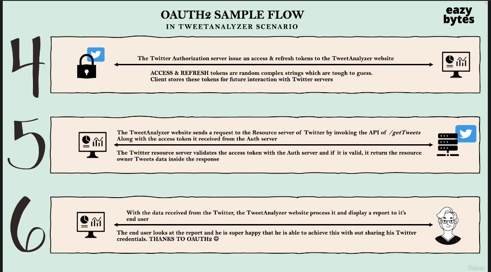

# Spring-Security

[For spring security zero to master](https://www.udemy.com/course/spring-security-zero-to-master/?src=sac&kw=spring+security+zero+to+master)

[Course github](https://github.com/eazybytes/springsecurity6)


# Section 1 Getting Started #

## Creating Spring Projects ##
can create a spring project at https://start.spring.io/
- most basic project uses spring web (web server default is tomcat), and dev tools
- can add in spring security for security starter

Diff with vs without spring security


### Adding Lombok ###
- for slf4j logging annotation 

```
    <dependency>
			<groupId>org.projectlombok</groupId>
			<artifactId>lombok</artifactId>
			<optional>true</optional>
		</dependency>
```

and exclude from the build 


```
  build>
		<plugins>
			<plugin>
				<groupId>org.springframework.boot</groupId>
				<artifactId>spring-boot-maven-plugin</artifactId>
				<configuration>
					<excludes>
						<exclude>
							<groupId>org.projectlombok</groupId>
							<artifactId>lombok</artifactId>
						</exclude>
					</excludes>
				</configuration>
			</plugin>
		</plugins>
  </build>

```

## Spring Security Out of the Box ##
- as soon as you add the spring security dependency, without doing anything it will start intercepting calls 
- will show a login screen, user: ```user```, password is printed in the console

## 6 Static Credentials ##
[common application properties](https://docs.spring.io/spring-boot/docs/current/reference/html/application-properties.html)
[yaml vs properties files](https://www.baeldung.com/spring-boot-yaml-vs-properties)

```
spring.security.user.name=myuser
spring.security.user.password=testing
```

## 7 Why Use Spring Security ##
- app security is very complex
- always new exploits, frameworks update and patch known vulnerabilities
- spring security is built by security experts, allowing us to secure our app for with very minimal configuration
- open source
- protects against common exploits
- Supports RBAC
- Supports various types of auth, JWT, OAuth2, OpenID, Username and Password etc...

## 8 Servlets VS Filters ##


- servlet is created internally by spring 
- filter is used to intercept every request to the application
- acts a middleware in between client and servlet/business logic

## 9 Spring Security Architecture ##


1. user enters credentials
2. Filters create authentication object such as the ```UsernamePasswordAuthenticationToken```
3. Authentication object handed to the authentication manager
4. Authentication Manager, which is implemented by ```ProviderManager``` checks available authentication provider
5. Authentication Providers decide if user is valid
  - can be many authentication providers
  - can write logic in authentication providers to decide how to authenticate
  - Authentication manager will try all authentication providers, not just one
  - Can leverage spring security classes ```UserDetailsManager``` and ```UserDetailsService```
6. Whatever ```PasswordEncoder``` bean encodes passwords as to not store in plain text
  - works with ```UserDetailsManager/Service``` to decide if the user should be authenticated
7. Sends response back to authentication manager
8. Forwards back to security filters
9. With an update Authentication Object, the filters store it in the security context
  - store authentication status, session id etc...
  - this is why user doesn't have to log in again
10. Final yes/no response sent back to end user


## 11 Spring Security Sequence Flow ##


## Annotations ##

```
@ComponentScan("com.eazybytes.sprinsecuritybasic.controller") 
```
- sprinsecuritybasic/src/main/java/com/eazybytes/sprinsecuritybasic/SprinsecuritybasicApplication.java

- optional in this setup as spring scans components in THIS and sub packages, however if we split our app out into a package outside springsecruitybasic then would need to annotate


# Section 2 Default Security Configurations #

## 17 Default Spring Security Configuration ##
- spring security protects all paths by default 
- this is configured in the ```defaultSecurityFilterChain``` bean


- ```http.authorizeRequests().anyRequest().authenticated();``` - says authorize any request made to the backend 

- from the comments 

```
The default configuration for web security. It relies on Spring Security's content-negotiation strategy to determine what sort of authentication to use. ** If the user specifies their own SecurityFilterChain bean, this will back-off completely and the users should specify all the bits that they want to configure as part of the custom security configuration **.
```
- if we create a bean of securityFilter chain then our custom auth will be taking place


## 18 Adding Custom Authentication Configuration ##
- can permit all or choose which paths need authentication

- see ./02_section/sprinsecuritysec2/src/main/java/com/eazybytes/config/ProjectSecurityConfig.java

## 19 Denying All Requests ##
- could deny all if they want
- could do this to either test security, go through updates or turn off the services for a period of time 


```
    @Bean
    SecurityFilterChain defaultSecurityFilterChain(HttpSecurity http) throws Exception {
        http.authorizeHttpRequests().anyRequest().denyAll();
        http.formLogin();
        http.httpBasic();
        return http.build();
    }
```

## 20 Allowing All Requests ##

- could allow all requests
- could be done for development environments via conditional beans 


```
    @Bean
    SecurityFilterChain defaultSecurityFilterChain(HttpSecurity http) throws Exception {
        http.authorizeHttpRequests().anyRequest().permitAll();
        http.formLogin();
        http.httpBasic();
        return http.build();
    }
```

# Section 3 Defining and Managing Users #
## 22 Approach 1 Configuring Users Using InMemoryUserDetailsManager ##
- not for production
- can define multiple users along with their authorities with the help fo ```InMemoryUserDetailsManager``` and ```UserDetails```
- use the ```withDefaultPasswordEncoder()``` method, this method is deprecated


## 23 Approach 2 Configuring Users Using inMemoryUserDetailsManager ##
- not for production
- here we create a bean of ```NoOpPasswordEncoder```, which implements ```PasswordEncoder```, this bean will automatically be picked up by spring


## 24 Understanding User Management Interfaces and Classes ## 


- the ```DaoAuthenticationProvider``` that comes with spring will look to user the ```inMemoryUserDetailsManager```, ```JdbcUserDetailsManager``` and ```LdapUserDetailsManager``` 
- the details managers are sample implementations provided by spring security
- The ```UserDetails``` interface allows us to represent the User as a ```User``` class that implements the ```UserDetails```
- When you return a new class of type ```...UserDetailsManager```, the ```loadUserByUsername``` method is called
  - this method returns ```UserDetails``` which implements ```UserDetailsManager ``` which extends ```UserDetailsService```

## 25 Deep Dive of UserDetails Interface and User Class ##
- holds methods for 
  1. getAuthorities()
  2. getPassword()
  3. getUsername()
  4. isAccountNonExpired()
  5. isAccountNonLocked()
  6. isCredentialsNonExpired()
  7. isEnabled()

- sample of this interface are the ```User``` Class, we can use this or implement our own ```userDetails```

- this object is readOnly, there are no setters, once the object is created through the constructor it is immutable
- 


- identify if authentication is successful or not inside the authentication providers
- ```AuthenticationProvider``` will convert the userDetails into the Authentication Token, after fetched from the database and authenticated
- this is done by default in the ```AbstractUserDetailsAuthenticationProvider.java```,  ```authenticate``` method, if authenticated then it called the ```createSuccessAuthentication``` method witch takes in an auth token, user and returns back a populated authentication token

## 26 Deep Dive of UserDetailsService and UserDetailsManager ##
- ```UserDetailsService```, holds the method ```loadUserByUsername``` which loads the user from the database
- only username is loaded, not the password, which we dont want to move over the network
- ```UserDetailsService```is extended by the ```UserDetailsManager``` which gives the ability to perform CRUD operations on users
   - offers a userExists() method that tells if that user already exists in the system

## 27 Deep Dive of UserDetailsManager implementation classes ##
- ```inMemoryUserDetailsManager```, ```JdbcUserDetailsManager``` and ```LdapUserDetailsManager```  are the most commonly used and examples are provided by spring


### InMemoryUserDetailsManager ###

- for ```InMemoryUserDetailsManager``` the ```createUser()``` method is called through the constructor 
- holds the ```loadUserByUsername()``` method 
- ```DaoAuthenticationProvider``` knows which details manager to invoke by which beans are created 
- ```InMemoryUserDetailsManager``` used mostly for dev and demo

### JdbcUserDetailsManager ###
- most common for production 
- spring security assumes a specific table structure, they have programmed queries for this configuration 
- table name must be ```users```
- there is a default schema included in the class, pointing to a ddl file. 
- can use the ```users.ddl``` file to create the database architecture


### Group Manager ###
- interface
- implemented by ```JdbcUserDetailsManager```
- helps create and add users to groups for RBAC


### LdapUserDetailsManager ###
- not as common
- still has ```loadUserByUserName```
- have to have an LDAP server configured

### Adding LDAP ###
- add following dependencies 

```
    <dependency>
			<groupId>org.springframework.ldap</groupId>
			<artifactId>spring-ldap-core</artifactId>
		</dependency>
		<dependency>
			<groupId>org.springframework.security</groupId>
			<artifactId>spring-security-ldap</artifactId>
		</dependency>
```

## 28 Creating MySQL DB ##


- can just do this in docker 

``` docker pull mysql```

```docker run --name spring-security-mysql -p 3306:3306 -e MYSQL_ROOT_PASSWORD=pwd -e useSSL=false -d mysql```

### Connecting with DBeaver ###
- host = localhost
- username = root
- pwd = pwd
- port = 3306 
- go to driver properties -> set ```allowPublicKeyRetrieval``` to true
- https://stackoverflow.com/questions/61749304/connection-between-dbeaver-mysql

## 29 Connecting to DB ##

- have to create and seed the database

```
create database eazybank;

use eazybank;

CREATE TABLE `users` (
`id` INT NOT NULL AUTO_INCREMENT,
`username` VARCHAR(45) NOT NULL,
`password` VARCHAR(45) NOT NULL,
`enabled` INT NOT NULL,
PRIMARY KEY (`id`));

CREATE TABLE `authorities` (
  `id` int NOT NULL AUTO_INCREMENT,
  `username` varchar(45) NOT NULL,
  `authority` varchar(45) NOT NULL,
  PRIMARY KEY (`id`));

INSERT IGNORE INTO `users` VALUES (NULL, 'happy', '12345', '1');
INSERT IGNORE INTO `authorities` VALUES (NULL, 'happy', 'write');

CREATE TABLE `customer` (
  `id` int NOT NULL AUTO_INCREMENT,
  `email` varchar(45) NOT NULL,
  `pwd` varchar(200) NOT NULL,
  `role` varchar(45) NOT NULL,
  PRIMARY KEY (`id`)
);

INSERT INTO `customer` (`email`, `pwd`, `role`)
 VALUES ('t@t.com', '54321', 'admin');

```

- can be used for small or flexible projects but example tables might not be usable for everyone

## 30 Using JdbcUserDetailsManager ##

- have to add dependencies for spring jdbc, mysql and spring data jpa

```
    <dependency>
			<groupId>org.springframework.boot</groupId>
			<artifactId>spring-boot-starter-jdbc</artifactId>
		</dependency>
		<dependency>
			<groupId>com.mysql</groupId>
			<artifactId>mysql-connector-j</artifactId>
			<scope>runtime</scope>
		</dependency>
		<dependency>
			<groupId>org.springframework.boot</groupId>
			<artifactId>spring-boot-starter-data-jpa</artifactId>
		</dependency>
```


- connect with 

```
# dont inject like this in production, should come from devops team
spring.datasource.url=jdbc:mysql://localhost/eazybank
spring.datasource.username=root
spring.datasource.password=pwd


#print sql in the console, not for production
spring.jpa.show-sql=true
spring.jpa.properties.hibernate.format_sql=true
```

- will then create the JdbcUserDetailsManager

```
    @Bean
    public UserDetailsService userDetailsService(DataSource dataSource){
        return new JdbcUserDetailsManager(dataSource);
    }

```

- Spring boot creates an object of type data source in memory when we add jbdc information to class path and application properties

- can have multiple ```UserDetailsManagers``` if have multiple ```AuthenticationProviders```


## 31 Creating Custom Authentication Tables ##
- in schema above
- will have to create your own JPA entity, wont be able to sue the default one

## 32 Creating JPA Entity and Repo For New Table ##
- have to create a repository
```
sprinsecuritysec3/src/main/java/com/eazybytes/repository/CustomerRepository.java
```
- have to create a model
```
sprinsecuritysec3/src/main/java/com/eazybytes/model/Customer.java
```

### Annotations ###
- have to add 2 annotations to spring application if repositories or entities are not in the main package
- will scan and create beans for the packages

```
@EnableJpaRepositories("com.eazybytes.repository")
@EntityScan("com.eazybytes.model")
```

- if not using the spring security starter must have annotation to turn on web security

```
@EnableWebSecurity
```

## 33 Create Custom Implementation of UserDetailsService ##
- if we are using our own database setup, we must override the default ```UserDetailsService``` and write logic for loading the user in the ```loadUserByUsername``` method

- sprinsecuritysec3/src/main/java/com/eazybytes/config/EazyBankUserDetails.java

### Multiple UserDetailsService ###
- if you have ```userDetailsService``` it will confuse the default ```DaoAuthenticationProvider```, can have multiple details services but have to have custom ```AuthenticationProvider```

## 34 Allowing New User Registration ##
- Could override the ```UserDetailsManager``` ```createUser() ``` method 
- see for example sprinsecuritysec3/src/main/java/com/eazybytes/controller/LoginController.java
- have to permit non authenticated users to hit the /register path
- this point can create with postman
```
{
    "email": "1@1.com",
    "pwd": "12345",
    "role": "user"
}
```

- successful response will be ```Given user details are successfully registered```

## Update Sequence With Custom  JBDC User Details Service ##


# Section 4 Password Management and Encoders #


## 35 How Are Passwords Validated In Spring Security By Default ##
- default password encoder uses plain text


- ```AbstractUserDetailsAuthenticationProvider``` - ```authenticate()``` method 
- runs some ```preAuthenticationChecks()``` such as checking for disabled, expired etc
- then runs ```DaoAuthenticationProvider``` - ```additionalAuthenticationChecks()```
   - ```additionalAuthenticationChecks()``` calls the ```matches()``` method defined in every password encoder 
   - ```matches``` takes in the password the user typed and the password loaded from the database
   - if passwords match you are authenticated
   - if not ```BadCredentialsException``` is thrown

### NoOpPasswordEncoder ###
- default password encoder
- doesn't actually encode anything
- stores passwords in plain text
- not for production


## 36 Encoding vs Encryption vs Hashing Part 1 ##


## 37 Encoding vs Encryption vs Hashing Part 2 ##


## 38 How to Validate Passwords With Hashing and Password Encoders ##

- password encoders take care of comparing hash strings

## 39 PasswordEncoder Interface ##
- includes:
1. encode - will put password through corresponding hash/encryption (even it that is none)
2. matches (true if the same, ie good login)
3. upgradeEncoding - can encode your password two times, default is false


## 40 Password Encoder Implementation Classes part 1 ##

- not for production

### NoOpPasswordEncoder ###
- default password encoder
- doesn't actually encode anything
- stores passwords in plain text
- not for production, only demo/dev

### StandardPasswordEncoder ###
- not for production
- deprecated
- only implemented to support legacy applications 
- sha-256, 1024 iterations and random 8-byte salt

### Pbkdf2PasswordEncoder ###
- can use in production but not recommended
- has become less secure over last few years
- susceptible to brute force attacks

## 41 Password Encoder Implementation Classes part 2 ##

- can use in production
- should have strong password requirements, ie: 8 Chars, letters, numbers and special characters
- strong password requirements make brute force nearly impossible with any of the following 3 passwordEncoders


### BCryptPasswordEncoder ###
- uses Bcrypt hashing algorithm
- continually updated based on hardware and best practices
- utilizes more cpu/resources
- less susceptible to brute force
- secure
- most commonly used 


### SCryptPasswordEncoder ###
- advance version of ```BCryptPasswordEncoder```
- uses both cpu and ram
- makes brute force attacks more difficult due to resource restriction
- more secure
### Argon2PasswordEncoder ###
- newest based on latest hashing algorithm 
- uses both cpu, ram and multiple threads
- make brute force tougher due to resource restriction
- also can slow down our application due to resource needs
- most secure

## 42 Register New User With ByCrypt Password Encoder ##
- create a passwordEncoder bean with the ```BCryptPasswordEncoder```

```
    @Bean
    public PasswordEncoder passwordEncoder(){

      return new BCryptPasswordEncoder();
    }
```

- passwords are not hashed when the creating an new user ex: 04_section/sprinsecuritysec4/src/main/java/com/eazybytes/controller/LoginController.java

- by default does 10 rounds of hashing but this can be configured
- could change options if wanted to utilizing different constructors of ```BCryptPasswordEncoder```
- min rounds is 4, max is 31, default is 10
- could pass a salt if we had one 

- from javadoc of ```BCryptPasswordEncoder```

```
Implementation of PasswordEncoder that uses the BCrypt strong hashing function. Clients can optionally supply a "version" ($2a, $2b, $2y) and a "strength" (a.k.a. log rounds in BCrypt) and a SecureRandom instance. The larger the strength parameter the more work will have to be done (exponentially) to hash the passwords. The default value is 10.
```

- see difference ins stored passwords


- plain text passwords will no longer with when ```BCryptPasswordEncoder``` is enabled
- ```BCryptPasswordEncoder``` knows this is not a BCrypt encoded password

- will give error in console

```
2023-01-03T17:37:21.975-05:00  WARN 54197 --- [nio-8888-exec-7] o.s.s.c.bcrypt.BCryptPasswordEncoder     : Encoded password does not look like BCrypt
```

## 43 Login With ByCrypt Password Encoder ##
- if using the default ```DaoAuthenticationProvider``` then no additional configuration is needed. ```DaoAuthenticationProvider```  will pick up the ```BCryptPasswordEncoder``` bean and  handle calling functions for password comparison 

- could define your own password encoder by implementing PasswordEncoder interface but not recommended

# Section 5 Authentication Providers #

## 44 Why create our own authentication provider ##
- the default authentication provider is ```DaoAuthenticationProvider```
- this is a flexible class that allows us to change ```UserDetailsService``` as well as ```PasswordEncoder```, however it does not support all use cases
- we may want to create our own authentication logic ie: only allowed age or countries
- may want multiple authentication providers


## 45 Authentication Provider methods ##
- ```authenticate()``` method actually kicks off the authenticate process
   - returns an authentication token with a user that is either authenticated or not
- ```supports()``` - tells which type of authentication objects are supported
   - called inside the ```ProviderManager```, which implements the ```AuthenticationManager``` interface, to check if the current authenticationProvider supports the type of authenticationToken that is passed in

- ```DaoAuthenticationProvider``` supports ```UsernamePasswordAuthenticationToken``` out of the box

- other auth tokens provided by spring
1. ```TestingAuthenticationToken```
2. ```AnonymousAuthenticationToken```
3. ```RememberMeAuthenticationToken```


## 46 Implementing Custom Authentication Provider ##
- since we created our own custom ```AuthenticationProvider```, we no longer need a ```userDetailsService```. If wa wanted to make our custom ```AuthenticationProvider``` depend on a ```userDetailsService```, like the default ```DaoAuthenticationProvider``` then we could use on, but not necessary as this logic is now in our ```EazyBankUsernamePwdAuthenticationProvider```, which is talking directly to the CrudRepository via DI


- example : sprinsecuritysec5/src/main/java/com/eazybytes/config/EazyBankUsernamePwdAuthenticationProvider.java

## 47 Testing our Custom Authentication Provider ##
- ```EazyBankUsernamePwdAuthenticationProvider.authenticate()``` is called by the spring security ```ProviderManager```
- after authentication is completed based on logic in the ```authenticate()``` method  the ```ProviderManager``` does some cleanup including deleting the credentials we were comparing against
- can also have an event published (an use this to send a push notification/email)

## 48 Spring Security Sequence Flow with Custom AuthenticationProvider ##

```Provider Manager``` implements ```AuthenticationManager```, they are interchangeable


- SpringSecurityFilter and ```AuthenticationManager``` do their own job, we do not override those
- we changed the authenticationProvider and its methods (which are called by the ```AuthenticationManager```), incorporating the database call into our custom ```EazyBankUsernamePwdAuthenticationProvider```. Since we were no longer using the default ```DaoAuthenticationProvider```, and incorporated the ```CustomerRepository``` logic, we did not need a ```UserDetailsService```/ ```UserDetailsManager```

- Also overrode the ```PasswordEncoder``` to use the ```BCryptPasswordEncoder```


# Section 6 #

- Starting in this section we will start using the Angular UI to talk to our backend

## 49 Setting up Separate UI ##
- directions for setting up are ./angular_ui/bank-app-ui/README.md

## 51 Creating new DB for schema ##

- run the following schema 

```
use eazybank;

drop table `users`;
drop table `authorities`;
drop table `customer`;
drop table accounts;

CREATE TABLE `customer` (
  `customer_id` int NOT NULL AUTO_INCREMENT,
  `name` varchar(100) NOT NULL,
  `email` varchar(100) NOT NULL,
  `mobile_number` varchar(20) NOT NULL,
  `pwd` varchar(500) NOT NULL,
  `role` varchar(100) NOT NULL,
  `create_dt` date DEFAULT NULL,
  PRIMARY KEY (`customer_id`)
);

INSERT INTO `customer` (`name`,`email`,`mobile_number`, `pwd`, `role`,`create_dt`)
 VALUES ('Happy','happy@example.com','9876548337', '$2y$12$oRRbkNfwuR8ug4MlzH5FOeui.//1mkd.RsOAJMbykTSupVy.x/vb2', 'admin',CURDATE());

CREATE TABLE `accounts` (
  `customer_id` int NOT NULL,
  `account_number` int NOT NULL,
  `account_type` varchar(100) NOT NULL,
  `branch_address` varchar(200) NOT NULL,
  `create_dt` date DEFAULT NULL,
  PRIMARY KEY (`account_number`),
  KEY `customer_id` (`customer_id`),
  CONSTRAINT `customer_ibfk_1` FOREIGN KEY (`customer_id`) REFERENCES `customer` (`customer_id`) ON DELETE CASCADE
);

INSERT INTO `accounts` (`customer_id`, `account_number`, `account_type`, `branch_address`, `create_dt`)
 VALUES (1, 18657645, 'Savings', '123 Main Street, New York', CURDATE());

CREATE TABLE `account_transactions` (
  `transaction_id` varchar(200) NOT NULL,
  `account_number` int NOT NULL,
  `customer_id` int NOT NULL,
  `transaction_dt` date NOT NULL,
  `transaction_summary` varchar(200) NOT NULL,
  `transaction_type` varchar(100) NOT NULL,
  `transaction_amt` int NOT NULL,
  `closing_balance` int NOT NULL,
  `create_dt` date DEFAULT NULL,
  PRIMARY KEY (`transaction_id`),
  KEY `customer_id` (`customer_id`),
  KEY `account_number` (`account_number`),
  CONSTRAINT `accounts_ibfk_2` FOREIGN KEY (`account_number`) REFERENCES `accounts` (`account_number`) ON DELETE CASCADE,
  CONSTRAINT `acct_user_ibfk_1` FOREIGN KEY (`customer_id`) REFERENCES `customer` (`customer_id`) ON DELETE CASCADE
);


INSERT INTO `account_transactions` (`transaction_id`, `account_number`, `customer_id`, `transaction_dt`, `transaction_summary`, `transaction_type`,`transaction_amt`,
`closing_balance`, `create_dt`)  VALUES (UUID(), 18657645, 1, "2022-12-24", 'Coffee Shop', 'Withdrawal', 30,34500, "2022-12-24");

INSERT INTO `account_transactions` (`transaction_id`, `account_number`, `customer_id`, `transaction_dt`, `transaction_summary`, `transaction_type`,`transaction_amt`,
`closing_balance`, `create_dt`)  VALUES (UUID(), 18657645, 1, "2022-12-25", 'Uber', 'Withdrawal', 100,34400,"2022-12-25");

INSERT INTO `account_transactions` (`transaction_id`, `account_number`, `customer_id`, `transaction_dt`, `transaction_summary`, `transaction_type`,`transaction_amt`,
`closing_balance`, `create_dt`)  VALUES (UUID(), 18657645, 1, "2022-12-26", 'Self Deposit', 'Deposit', 500,34900,"2022-12-26");

INSERT INTO `account_transactions` (`transaction_id`, `account_number`, `customer_id`, `transaction_dt`, `transaction_summary`, `transaction_type`,`transaction_amt`,
`closing_balance`, `create_dt`)  VALUES (UUID(), 18657645, 1, "2022-12-27", 'Ebay', 'Withdrawal', 600,34300,"2022-12-27");

INSERT INTO `account_transactions` (`transaction_id`, `account_number`, `customer_id`, `transaction_dt`, `transaction_summary`, `transaction_type`,`transaction_amt`,
`closing_balance`, `create_dt`)  VALUES (UUID(), 18657645, 1, "2022-12-28", 'OnlineTransfer', 'Deposit', 700,35000,"2022-12-28");

INSERT INTO `account_transactions` (`transaction_id`, `account_number`, `customer_id`, `transaction_dt`, `transaction_summary`, `transaction_type`,`transaction_amt`,
`closing_balance`, `create_dt`)  VALUES (UUID(), 18657645, 1, "2022-12-29", 'Amazon.com', 'Withdrawal', 100,34900,"2022-12-29");


CREATE TABLE `loans` (
  `loan_number` int NOT NULL AUTO_INCREMENT,
  `customer_id` int NOT NULL,
  `start_dt` date NOT NULL,
  `loan_type` varchar(100) NOT NULL,
  `total_loan` int NOT NULL,
  `amount_paid` int NOT NULL,
  `outstanding_amount` int NOT NULL,
  `create_dt` date DEFAULT NULL,
  PRIMARY KEY (`loan_number`),
  KEY `customer_id` (`customer_id`),
  CONSTRAINT `loan_customer_ibfk_1` FOREIGN KEY (`customer_id`) REFERENCES `customer` (`customer_id`) ON DELETE CASCADE
);

INSERT INTO `loans` ( `customer_id`, `start_dt`, `loan_type`, `total_loan`, `amount_paid`, `outstanding_amount`, `create_dt`)
 VALUES ( 1, '2020-10-13', 'Home', 200000, 50000, 150000, '2020-10-13');

INSERT INTO `loans` ( `customer_id`, `start_dt`, `loan_type`, `total_loan`, `amount_paid`, `outstanding_amount`, `create_dt`)
 VALUES ( 1, '2020-06-06', 'Vehicle', 40000, 10000, 30000, '2020-06-06');

INSERT INTO `loans` ( `customer_id`, `start_dt`, `loan_type`, `total_loan`, `amount_paid`, `outstanding_amount`, `create_dt`)
 VALUES ( 1, '2018-02-14', 'Home', 50000, 10000, 40000, '2018-02-14');

INSERT INTO `loans` ( `customer_id`, `start_dt`, `loan_type`, `total_loan`, `amount_paid`, `outstanding_amount`, `create_dt`)
 VALUES ( 1, '2018-02-14', 'Personal', 10000, 3500, 6500, '2018-02-14');

CREATE TABLE `cards` (
  `card_id` int NOT NULL AUTO_INCREMENT,
  `card_number` varchar(100) NOT NULL,
  `customer_id` int NOT NULL,
  `card_type` varchar(100) NOT NULL,
  `total_limit` int NOT NULL,
  `amount_used` int NOT NULL,
  `available_amount` int NOT NULL,
  `create_dt` date DEFAULT NULL,
  PRIMARY KEY (`card_id`),
  KEY `customer_id` (`customer_id`),
  CONSTRAINT `card_customer_ibfk_1` FOREIGN KEY (`customer_id`) REFERENCES `customer` (`customer_id`) ON DELETE CASCADE
);

INSERT INTO `cards` (`card_number`, `customer_id`, `card_type`, `total_limit`, `amount_used`, `available_amount`, `create_dt`)
 VALUES ('4565XXXX4656', 1, 'Credit', 10000, 500, 9500, "2022-12-31");

INSERT INTO `cards` (`card_number`, `customer_id`, `card_type`, `total_limit`, `amount_used`, `available_amount`, `create_dt`)
 VALUES ('3455XXXX8673', 1, 'Credit', 7500, 600, 6900, "2022-12-31");

INSERT INTO `cards` (`card_number`, `customer_id`, `card_type`, `total_limit`, `amount_used`, `available_amount`, `create_dt`)
 VALUES ('2359XXXX9346', 1, 'Credit', 20000, 4000, 16000, "2022-12-31");

CREATE TABLE `notice_details` (
  `notice_id` int NOT NULL AUTO_INCREMENT,
  `notice_summary` varchar(200) NOT NULL,
  `notice_details` varchar(500) NOT NULL,
  `notic_beg_dt` date NOT NULL,
  `notic_end_dt` date DEFAULT NULL,
  `create_dt` date DEFAULT NULL,
  `update_dt` date DEFAULT NULL,
  PRIMARY KEY (`notice_id`)
);

INSERT INTO `notice_details` ( `notice_summary`, `notice_details`, `notic_beg_dt`, `notic_end_dt`, `create_dt`, `update_dt`)
VALUES ('Home Loan Interest rates reduced', 'Home loan interest rates are reduced as per the goverment guidelines. The updated rates will be effective immediately',
CURDATE() - INTERVAL 30 DAY, CURDATE() + INTERVAL 30 DAY, CURDATE(), null);

INSERT INTO `notice_details` ( `notice_summary`, `notice_details`, `notic_beg_dt`, `notic_end_dt`, `create_dt`, `update_dt`)
VALUES ('Net Banking Offers', 'Customers who will opt for Internet banking while opening a saving account will get a $50 amazon voucher',
CURDATE() - INTERVAL 30 DAY, CURDATE() + INTERVAL 30 DAY, CURDATE(), null);

INSERT INTO `notice_details` ( `notice_summary`, `notice_details`, `notic_beg_dt`, `notic_end_dt`, `create_dt`, `update_dt`)
VALUES ('Mobile App Downtime', 'The mobile application of the EazyBank will be down from 2AM-5AM on 12/05/2020 due to maintenance activities',
CURDATE() - INTERVAL 30 DAY, CURDATE() + INTERVAL 30 DAY, CURDATE(), null);

INSERT INTO `notice_details` ( `notice_summary`, `notice_details`, `notic_beg_dt`, `notic_end_dt`, `create_dt`, `update_dt`)
VALUES ('E Auction notice', 'There will be a e-auction on 12/08/2020 on the Bank website for all the stubborn arrears.Interested parties can participate in the e-auction',
CURDATE() - INTERVAL 30 DAY, CURDATE() + INTERVAL 30 DAY, CURDATE(), null);

INSERT INTO `notice_details` ( `notice_summary`, `notice_details`, `notic_beg_dt`, `notic_end_dt`, `create_dt`, `update_dt`)
VALUES ('Launch of Millennia Cards', 'Millennia Credit Cards are launched for the premium customers of EazyBank. With these cards, you will get 5% cashback for each purchase',
CURDATE() - INTERVAL 30 DAY, CURDATE() + INTERVAL 30 DAY, CURDATE(), null);

INSERT INTO `notice_details` ( `notice_summary`, `notice_details`, `notic_beg_dt`, `notic_end_dt`, `create_dt`, `update_dt`)
VALUES ('COVID-19 Insurance', 'EazyBank launched an insurance policy which will cover COVID-19 expenses. Please reach out to the branch for more details',
CURDATE() - INTERVAL 30 DAY, CURDATE() + INTERVAL 30 DAY, CURDATE(), null);

CREATE TABLE `contact_messages` (
  `contact_id` varchar(50) NOT NULL,
  `contact_name` varchar(50) NOT NULL,
  `contact_email` varchar(100) NOT NULL,
  `subject` varchar(500) NOT NULL,
  `message` varchar(2000) NOT NULL,
  `create_dt` date DEFAULT NULL,
  PRIMARY KEY (`contact_id`)
);
```

- other scripts to create account number for other users
```
INSERT INTO `accounts` (`customer_id`, `account_number`, `account_type`, `branch_address`, `create_dt`)
VALUES (2, 123456, 'Savings', '123 Main Street, New York', CURDATE());
```


## 53 creating A New User With Postman ##

- can post to ```localhost:8888/register```
```
{
    "name": "John Doe",
    "email": "1@1.com",
    "mobileNumber": "1234567890",
    "pwd": "12345",
    "role": "user"
}
```

- there is a sign up link in the UI but it is not configured

## 54 Cors Error ##
- Cross Origin Resource Sharing
- when making requests across origin


## 55 Introduction to Cors ##

- have to configure if we want to talk cross origin
- default is to block this 

## 56 Options to Fix Cors ##

- sprinsecuritysec7/src/main/java/com/eazybytes/config/ProjectSecurityConfig.java


- The browser sends a preflight request to the server and this is where origin data is communicated
- can use the ```@CrossOrigin``` annotation
- could explicitly configure it to an endpoint or to '*'
- It may not be feasible to do this for every single controller in an application

- can configure globally using spring security instead inside the defaultSecurityChain


## 57 Fixing Cors Using Spring Security ##
- configuration is fed into HttpSecurity 
- can see configuration: sprinsecuritysec6/src/main/java/com/eazybytes/config/ProjectSecurityConfig.java


## 58 Demo of CSRF Protection from Spring Security ## 
- Cross Site Request Forgery
- Spring security blocks updates to post/put operations that update data by default 
- could turn it off with ```http().csrf().disable()``` , not for production

- if this is on and not configured and posts will get a 401, have to explicitly say who is allowed to post/put

## 59 Example CSRF Attack ##
- also known as XSRF


## 60 Solutions for CSRF Attacks ##
- using a secondary secure CSRF token that is injected in a header by the app, to ensure th request is not being forged


## 61 Ignoring CSRF Protection For Public API endpoints ##

- can use to expose certain public endpoints beyond csrf protection


```
csrf().ignoringRequestMatchers("/contact", "/register")
```
- use to be ```ignoreAntMatchers()```

## 62 Implementing CSRF Token Solution ##
- by default spring ```CookieCsrfTokenRepository``` will create a token with the name ```XSRF-TOKEN```
- Sinec Spring v3 we need a ```OncePerRequestFilter``` to create the header on each request

- [what is once per requests filter](https://www.baeldung.com/spring-onceperrequestfilter)
- sprinsecuritysec7/src/main/java/com/eazybytes/filter/CsrfCookieFilter.java
### Part 1 - Backend ###
- sprinsecuritysec6/src/main/java/com/eazybytes/config/ProjectSecurityConfig.java
```
...
//-------------------- CSRF--------------------------
                //tell spring security these are public apis, but will protect all other endpoints
                //csrf process against malicious posts/puts so don't need notices as it only gets
                .csrf().ignoringRequestMatchers("/contact", "/register")

                // create a CSRF token and send it as a cookie,  and with withHttpOnlyFalse(), it allows the UI to read the cookie via JavaScript
                .csrfTokenRepository(CookieCsrfTokenRepository.withHttpOnlyFalse())
                //filter responsible for injecting the cookie
                .and().addFilterAfter(new CsrfCookieFilter(), BasicAuthenticationFilter.class)

...
```

### Part 2 - Frontend ###
- have to handle reading and return the cookie in javascript on the frontend
- angular_ui/bank-app-ui/src/app/components/login/login.component.ts

```
validateUser(loginForm: NgForm) {
    this.loginService.validateLoginDetails(this.model).subscribe(
      responseData => {
        this.model = <any> responseData.body;
        this.model.authStatus = 'AUTH';
        window.sessionStorage.setItem("userdetails",JSON.stringify(this.model));
        // get the cookie and store is in session storage
        let xsrf = getCookie('XSRF-TOKEN')!;
        window.sessionStorage.setItem("XSRF-TOKEN",xsrf);
        this.router.navigate(['dashboard']);
      });

  }
```
- retrieve the cookie and set it in session storage 
- angular_ui/bank-app-ui/src/app/interceptors/app.request.interceptor.ts
```
    //get the token from session storage and put it in the headers
    let xsrf = sessionStorage.getItem('XSRF-TOKEN');
    if(xsrf){
      httpHeaders = httpHeaders.append('X-XSRF-TOKEN', xsrf);  
    }
```

### Basic Authentication ##
- with this configuration we now go through the ```BasicAuthenticationFilter``` as we post authentication to the ```/user``` endpoint
- the ```BasicAuthenticationFilter``` calls the ```ProviderManager``` which calls the ```EazyBankUsernamePwdAuthenticationProvider.authenticate()``` method, this fetches the user and does the authentication by calling ```PasswordEncoder.matches()``` method, if it does match then the ```UsernamePasswordAuthenticationToken``` constructor si called which creates the auth token and sets authenticated to true
- the authentication information is encoded on a ```Authorization Basic:``` header
- this is not recommend for production apps as the username and password are not encrypted on the header, they only exist in as base 64

# Section 7 Authorization #
## 64 Authentication vs Authorization ##


## 65 How Authorities Are Stored In Spring Security ##


- authorities are passed to ```UsernamePasswordAuthenticationToken``` upon creation as an unmodifiable list
- authorities and roles are very similar and used to create ```GrantedAuthorities```


## 66 Creating New Table Authorities ##
- create an authorities table and use the id as a foreign key for the user
- see ./database_seed.sql

## 67 Backend Changes to Load Authorities ##
- have to create a new entity ```Authority``` to account for new table in db
- sprinsecuritysec7/src/main/java/com/eazybytes/model/Authority.java
- have to map ```Authority``` model, ```@manyToOne``` to ```Customer``` model
- this will pull authorities based on primary/foreign key from the db and map them to the customer object upon request of the customer


## 68 and 69 Configure Authorities Inside App Using Spring Security ## 

- sprinsecuritysec7/src/main/java/com/eazybytes/config/ProjectSecurityConfig.java


- ```hasAuthority``` - have to have the exact authority
- ```hasAnyAuthority```, if they have any of the acceptable ones
- if neither of above options work use ```access()``` which allows us to configure using spring expression language


- can invoke after ```requestMatchers```
- ```requestMatchers``` replaced ```antMatchers``` in spring v 3

- see example 

```
          http.
          ...     
                .authorizeHttpRequests()

                // performing RBAC with authorities
                .requestMatchers("/myAccount").hasAuthority("VIEWACCOUNT")
                .requestMatchers("/myBalance").hasAnyAuthority("VIEWACCOUNT","VIEWBALANCE")
                .requestMatchers("/myLoans").hasAuthority("VIEWLOANS")
                .requestMatchers("/myCards").hasAuthority("VIEWCARDS")
                //secure these paths so only authenticated users can access
                .requestMatchers( "/user").authenticated()
                //allow anyone to see this
                .requestMatchers("/notices", "/contact", "/register").permitAll();
      ...
        return http.build();

```

### Session Management ###
- as of spring boot 3 and security 6 we now need to explicitly tell spring to always create new sessions 
- this will create a new session each time the user logs in
- if you restart the server, must re-login to get a valid JSessionID

```
                .and().sessionManagement(session -> session.sessionCreationPolicy(SessionCreationPolicy.ALWAYS))
```

## 70 Authority vs Role in Spring Security ##


- authority is one individual privilege (fine grained)
- role is a group of privileges/actions (course grained)
- roles also us ```GrantedAuthority``` and ```SimpleGrantedAuthority```
- when using roles it should awalys start with the ```ROLE_``` prefix as to differentiate between authorities and roles

## 71 and 72 Configuring Roles Authorization ##
- sprinsecuritysec7/src/main/java/com/eazybytes/config/ProjectSecurityConfig.java


- ```hasRole``` - have to have the exact authority
- ```hasAnyRole```, if they have any of the acceptable ones
- if neither of above options work use ```access()``` which allows us to configure using spring expression language
- **DO NOT USE THE ROLE PREFIX IN CODE, spring adds the prefix value**

ex: 


- new sequence flow with roles 


### Other methods ###
- could use ```hasIPAddress``` to really secure the app (may have bee deprecated in version 3)

# Section 8 Custom Spring Filters #

## 73 Spring Filters and Simple Use Cases ##

-  spring security filters play a vital role inside spring security


- could create a custom filter to do whatever we want it to such as intercepting requests and adding headers, logging auth data at a certain point, encryption of input data, add MFA 

- filters are processed in a chain fashion executing sequentially one at a time

## 74 Demo of Built In Filters ##


- changes are not for production, will create large security risk


```
@EnableWebSecurity(debug = true)
```
```
logging.level.org.springframework.security.web.FilterChainProxy=DEBUG
```

- logging level also turns on ```logger.isDebugEnabled```

## 75 Creating Custom Filters ##


``` Filter``` interface exposes 
- ```init()```: empty by default, runs on creation of filter
- ```destroy()```: empty by default runs on destruction of filter
- ```doFilter()```: the main method that must be overridden when creating a custom filter

## 76 77 78 Adding Custom Filters ##
- sprinsecuritysec8/src/main/java/com/eazybytes/config/ProjectSecurityConfig.java

- filter chain before modification


 
### AddFilterBefore ###

- sprinsecuritysec8/src/main/java/com/eazybytes/filter/RequestValidationBeforeFilter.java

- also have to add code to ```defaultSecurityFilterChain``` to add in the new filter

```
 //adding custom validation filter before the BasicAuthenticationFilter in the filter chain
 //filter we ant to add, where we want it to go
  .addFilterBefore(new RequestValidationBeforeFilter(), BasicAuthenticationFilter.class )
```

- can see new filter is now in the chain


### AddFilterAfter ###


- want to add a logger after authentication to log who logs in 
- sprinsecuritysec8/src/main/java/com/eazybytes/filter/AuthoritiesLoggingAfterFilter.java

- after writing filter have to add it to the ```defaultSecurityFilterChain```

```
.addFilterAfter(new AuthoritiesLoggingAfterFilter(), BasicAuthenticationFilter.class)
```

- after we add the filter the chain now looks like 


- and in the logs we get 

```
User 0@1.com is successfully authenticated and has the authorities [VIEWLOANS, VIEWBALANCE, ROLE_USER, ROLE_ADMIN, VIEWCARDS, VIEWACCOUNT]
```

### AddFilterAt ###

- adds a filter to run around the same time as the other one passed in, however spring will execute these filters in a random order
- not used a lot as can be unpredictable 
- here we will log as the ```BasicAuthenticationFilter``` is running
- sprinsecuritysec8/src/main/java/com/eazybytes/filter/AuthoritiesLoggingAtFilter.java

- after writing filter have to add it to the ```defaultSecurityFilterChain```
```
  // adding custom logging filter at the time of the BasicAuthenticationFilter
  .addFilterAt(new LoggingAtAuthenticationFilter(), BasicAuthenticationFilter.class)
```

- after adding this filter the chain now looks like:


- can see all the custom filters we have added so far


## 79 Generic Filter Bean and OncPerRequestFilter ##
- other options for custom filters

### Generic Filter Bean ###
- abstract class in spring web
- simple base implementation of ```Filter```
- superclass for any type of filter
- can provide access to all the config and init parameters
- ```getEnvironment()```, ```getFilterConfig()```, ```getServletContext()```, ```init()``` - some of the methods exposed by this class, making all these details available 

### OncePerRequestFilter ###
- regular filters are not limited to running once per request, in theory could run many times per request
- A custom filter that extends ```OncePerRequestFilter``` is guaranteed to run only 1 time per request
- extends ```GenericFilterBean```
- business logic should be inside the ```doFilterInternal()``` method
- other useful methods - ```shouldNotFilter()```, can decide to not filter certain requests 
- example: sprinsecuritysec8/src/main/java/com/eazybytes/filter/CsrfCookieFilter.java
- ```BasicAuthenticationFilter``` extends ```OncePerRequestFilter```
- recommended for use over regular filter due to guarantees that it only runs 1 time


## 80 Regex Matches For Applying Path Restrictions ##
- all methods in this image have been replaced by ```requestMatchers()``` in spring v3 / spring security v6
- examples of [request matchers](https://www.tabnine.com/code/java/methods/org.springframework.security.config.annotation.web.builders.HttpSecurity/requestMatchers)


# Section 9 Authentication With JWT #

## 81 JSESSIONID and Issues With It ##
-  ```JSESSIONID``` - tell spring whether user is a valid logged in user
- this is a simple token, good for what it does but wont help with communications between services
- does not hold any user data
- saved as a cookie in the browser, which is tied to the session

## 82 Advantages of Token Based Authentication ##

- could be plain string or more complex like JWT
- usually generated on Login
- token is sent on every request to the backend server, which the server then has to validate
- backend server usually smart enough to understand it has to validate the token 


### Advantages of Tokens ###

- especially useful tp purge tokens if security breach
- help execute single sign on, and stateless authentication by passing the validated token around
- 

## 83 84 Deep Dive of JWT ##


- uses base64 encoding
- header - store metadata in the token, ie: algorithm, type etc
- body - can store any data about the user/issuer here
- signature - can be used to validate the token
- should validate on each request
- to easily decode jwt's use [jwt.io](https://jwt.io)
- no database needed as token is stored in browser and comparison is recomputed in the app

### Validating JWTs ###

- if all communication is withing your LAN/Firewall you don't have to worry about JWT tampering as much
- if you are communicating outside your network you must validate the signature of your JWT to ensure no one has tampered with it

- backend will regenerate the signature hash using it's secret and compare it to the received JWT to see if the JWT has been tampered with 

## 85 Configuring App to Use JWTs ##
- sprinsecuritysec9/src/main/java/com/eazybytes/config/ProjectSecurityConfig.java

### Dependencies ###
- must add the following dependencies

```
		<dependency>
			<groupId>io.jsonwebtoken</groupId>
			<artifactId>jjwt-api</artifactId>
			<version>0.11.5</version>
		</dependency>
		<dependency>
			<groupId>io.jsonwebtoken</groupId>
			<artifactId>jjwt-impl</artifactId>
			<version>0.11.5</version>
			<scope>runtime</scope>
		</dependency>
		<dependency>
			<groupId>io.jsonwebtoken</groupId>
			<artifactId>jjwt-jackson</artifactId> <!-- or jjwt-gson if Gson is preferred -->
			<version>0.11.5</version>
			<scope>runtime</scope>
		</dependency>
```

### Security Configuration ###
- must turn of ```JSESSIONID``` generation  by setting ```sessionCreationPolicy``` to ```STATELESS```

```
.and().sessionManagement(session -> session.sessionCreationPolicy(SessionCreationPolicy.STATELESS))
```

- then have to configure backend to send ```Authorization``` header to the frontend 
- in the cors configuration have to add

```
corsConfiguration.setExposedHeaders(Arrays.asList("Authorization"));
```

## 86 87 Security Filters and JWTs ##
- sprinsecuritysec9/src/main/java/com/eazybytes/config/ProjectSecurityConfig.java
### Generating JWT ###
- write filter to generate token
- only want token generated on initial login

sprinsecuritysec9/src/main/java/com/eazybytes/filter/JWTTokenGeneratorFilter.java

- filter will be added after the ```BasicAuthenticationFilter```

```
.addFilterAfter(new JWTTokenGeneratorFilter(), BasicAuthenticationFilter.class)
```

### Validating JWT ###
- sprinsecuritysec9/src/main/java/com/eazybytes/filter/JWTTokenValidatorFilter.java
- write filter to validate token
- want this to run on all authenticated requests except initial login
- will be executed before the ```BasicAuthenticationFilter```, to validate the JWt before getting there

```
 .addFilterBefore(new JWTTokenValidatorFilter(), BasicAuthenticationFilter.class)
```


## 88 Client App Changes to Handle JWT ##
- it is the clients responsibility on each request to save the token in the browser on login
- angular_ui/ui-section-9/src/app/components/login/login.component.ts

```
 window.sessionStorage.setItem("Authorization", responseData.headers.get("Authorization")!);
 ```
 - also the clients responsibility to send token back to backend on request
 -angular_ui/ui-section-9/src/app/interceptors/app.request.interceptor.ts

 ```
      let authorization = sessionStorage.getItem("Authorization")
      if(authorization){
        httpHeaders = httpHeaders.append("Authorization", authorization)
      }
 ```


## 89 Validating JWT is Working ##
- with changes from this section should now see 

   1. ```Authorization``` JWT in you application - session storage
   2. Only th ```XSRF-TOKEN``` in the cookies, there should be no more ```JSESSIONID``` as we turned that off

   *if you still have a ```JSESSIONID``` there is a good chance it is cached*

- now the filter chain holds our new JWT filters


## 90 Validating JWT Expiration ##
- if JWT is expired the backend will throw an ```ExpiredJWT``` exception and the user should log back in


# Section 10 Method Level Security #

- compliments RBAC, does not replace 

## 91 Introduction to Method Level Security ##


- method security must be enabled with ```@EnableMethodSecurity```, as it is disabled by default
- allows for fine grained access control

## 92 Details About Method Invocation Authorization ##

- accept spring expression language as well as role and authority methods


- post authorization is used to validate the data being returned from the method

- ```PermissionElevator.hasPermission()``` allows much more fine grained authentication
- spring uses spring [AOP](https://www.baeldung.com/spring-aop) at runtime to intercept method calls and ensure users have the correct permissions

## 93 Method Level Security with PreAuthorize ##
- allow spring expression language
- most common to be used
- exmaple sprinsecuritysec10/src/main/java/com/eazybytes/repository/LoanRepository.java

```
@PreAuthorize("hasRole('User')")
```


## 94 Method Level Security with PostAuthorize ##
- allow spring expression language
- sprinsecuritysec10/src/main/java/com/eazybytes/controller/LoansController.java

```
@PostAuthorize("hasRole('USER')")
```

## 95 Filtering with Method Level Security ##


- **this is not Spring Security Filter**
- can filter the method call based on the parameters being passed in
- ```filterObject```, the method input, should alway be of type ```Collection```
- could say, get this collection but don't return where the userName = "test"


## 96 PreFilter Annotation ##

- for filtering parameters passed into a method

- sprinsecuritysec10/src/main/java/com/eazybytes/controller/ContactController.java

```
 @PreFilter("filterObject.contactName != 'Test'")
```
## 97 PostFilter Annotation ##

- for filtering returned values from a method 
- sprinsecuritysec10/src/main/java/com/eazybytes/controller/ContactController.java

```
 @PostFilter("filterObject.contactName != 'Test'")
```

# Section 11 Deep Dive Into Oauth2 and OpenID Connect ##
- theory section
- if you use microservices/multiple applications it can be better to have an authentication server instead of having authentication/authorization logic in every application

## 98 Problem OAuth2 is Trying to Solve ##


- by sharing a limited authorization token we can give the 3rd party access to the app without having to trust that application isnt going to mis-use their permissions
- could revoke these tokens 
- there is a separate OAuth2 server handling the authentication and token creation

### Common Accounts Using OAuth ###


## 99 Introduction to OAuth2 ##
- [oauth docs](https://oauth.net/2/)


- OAuth2 is a standard, there are many different flavors.
- there is no OAuth2 code 
- different grant types are for different use cases
   - Authorization Code - user accounts
   - PKCE - used for SPA
   - Client Credentials - server to server communication
   - Device Code - for IOT such as smart tv
   - Refresh Token 
   - Implicit Flow (deprecated, will be remove with Oauth2.1)
   - Password Grant (deprecated, will be remove with Oauth2.1)

### OAuth2.1 ###
- [its time for OAuth2.1](https://aaronparecki.com/2019/12/12/21/its-time-for-oauth-2-dot-1)
- removing unused grants 
- simplifying overall standards

## 100 OAuth2 Terminology ##

- resource owner : the user who owns the resources being accessed
- client : the third party app/service trying to interact with service that needs authentication
- Authorization Server : responsible for authenticating user, resource owner has an account on this server
- Resource Server : server where the resources the client wants to consume are located 
   - depending on the size of the project the Authorization Server and Resource Server could be the same machine 
- Scopes : granular permissions, very similar to roles/authorities


## 101 OAuth2 Sample Flow ##


- fictional scenario for example
- Must register app as a ```Client``` with the ```Authorization Server``` when you register as a ```Client``` you get a ```Client ID``` and ```Client Secret```
- on login ```Client``` must redirect to the ```Authorization Server```, user credentials never shared with the ```Client```
- Then ```Resource Owner``` asked if they consent to sharing resources with ```Client```
- If the ```Resource Owner``` agrees then ```ACCESS TOKEN``` and ```REFRESH TOKEN``` are shared with the ```Client``` from the ```Authorization Server```
   - ```Authorization Server``` decides how long the tokens are good for
- ```Client``` sends api requests with ```ACCESS TOKEN``` to the ```Resource Server```, verifies the token with the ```Authorization Server```
   - the ```ACCESS TOKEN``` is scoped to only the permissions needed by the ```Client```, the ```Client``` cannot update account credentials etc...
- ```Resource Server``` sends requested resources to ```Client``` 
- most times you will be redirected back to the ```Client``` after providing consent

### 102 Demo of Sample Flow ###
- sign up for any account with google, facebook, github etc...
- example using slack 
   - ```Resource Owner``` : you 
   - ```Client``` : slack
   - ```Authorization Server``` : run by google
   - ```Resource Server```: run by google
   - ```ACCESS TOKEN``` : provided by ```Authorization Server```

-  most real customers may have their own ```Authorization Server```

## 103 Deep Dive and Demo Authorization Code Grant Type Flow in OAuth2 ##
- have to choose grant type based on use case
- use when we have an end user and 2 resources trying to communicate with each other on behalf of the user
- more secure, has superseded ```Implicit Grant```, 


5. ```ClientID``` and ```ClientSecret```  shared from client to ```Authorization Server```


- more secure then ```Implicit Grant Type```


1. ```Resource Owner``` requests login
2. ```Client``` redirects  ```Resource Owner``` to the ```Auth Server```, also appends important information such as ```ClientID``` to tell ```Auth Server``` what ```Client``` to give access to,  ```SCOPE``` for type of access, and ```REDIRECT URI``` to get back to original ```Client```
3. ```Resource Owner``` logs into ```Auth Server```
4. ```Auth Server``` provides ```Client``` with ```Authorization Code```
5. ```Client``` provides ```Auth Server``` with ```Authorization Code```, ```ClientID```, ```ClientSecret```, ```Grant Type``` and ```Redirect URI```
6. if all checks out ```Auth Server``` provides ```Client``` with ```Access Token```
7. ```Client``` requests resources on from ```Resource Server``` on behalf of the ```Resource Owner``` and sends the ```Access Token``` to authenticate
8. Resources returned to the ```Client``` from the ```Resource Server```


### Demo ###
[oauth playground](https://www.oauth.com/playground/)


## 105 Deep Dive and Demo Implicit Grant Flow in OAuth2 ##
- deprecated, not to be use for production
- will be removed from OAuth2.1


- less secure because there is no way to send the ```ClientSecret``` in get requests outside of the Url. This would exposing the client credentials it to the world
- ```Access Token``` would also come in the URL as well, exposed it
- No was to reliably prevent a malicious user from inject in a different token

### Demo ###
[oauth playground](https://www.oauth.com/playground/)

## 106 Deep Dive of Password Grant Type Flow in OAuth2 ##


- also know as ```Resource Owner Credentials Grant```
- no recommended for production
- in this case ```Resource Owner``` credentials are given dirctly to the ```Client```
- the ```Client``` then posts the ```Resource Owner``` credentials, ```ClientID``` and ```ClientSecret``` to the ```Authorization Server```
- ```Authorization Server``` sends back an ```Access Token``` to the ```Client``` which the ```Client``` can then use to access the ```Resouce Server``` on behalf of the ```Resource Owner```

- could be used if all the parties are part of the sam organization
- being removed in Oauth2.0+


### Demo ###
[oauth playground](https://www.oauth.com/playground/)

## 107 Deep Dive of Credentials Grant Type Flow in OAuth2 ##


- only have a ```Client```, ```Auth Server``` and ```Resource Server```, no user 
- grant_type will be 'client_credentials'


1. ``` Client``` sends request to ```Auth Server```, it states there is no end user and provides ```ClientID``` and ```Client Secret```
2. ```Auth Server```, provides ```Access Token``` to ```Client```
3. ```Client``` sends request to ```Resource Server``` with the ```Access Token```
4. If all good ```Resource Server``` sends back resources to the ```Client``` 

## 108 Deep Dive of Refresh Token Grant Type Flow in OAuth2 ##


- inside the response after a successfully authentication, there is usually a ```Refresh Token```
- will be required to refresh the ```Access Token``` after x amount of time
- ```Client``` cna use the ```Refresh Token``` to request a new ```Access Token``` from the ```Auth Server``` if the ```Refresh Token``` is valid
  - does not require end user to login again
- it is the job of the ```Client``` application to implement this refresh token configuration

## 109 How Resource Server Validates Tokens Issue by the Auth Server ##

### Approach 1 Communication ###


- ```Resource Server``` must reach out to ```Authorization Server``` with the provided ```Access Token``` to validate that token on ```Client``` requests

### Approach 2 Common Database ###


- store all valid tokens in a common database and check if the ```Access Token``` is present 

### Approach 3 Certificates ###


- ``` Resource Server``` has the public key of ```Access Server```, it can use the public key to validate any ```Access Tokens```
- most common and recommended approach


## 110 Introduction to OpenID Connect ##
- not a grant type flow
- OIDC is a wrapper around OAuth2


- OIDC (Open ID Connect) sits on top of OAuth2 for authentication, and brings standards for sharing identity details
- there is no way with OAuth2 to know details about the client, ie: username, email etc...
- ```Authorization Server``` is smart enough to know that if ```openid``` exists in the ```SCOPE```, then it returns both an ```Access Token``` and ```ID Token```


- With ```Access Token``` and ```ID Token``` we now have IAM, a more advanced concept implemented by Keycloak and other OAuth2 providers
### Demo ###
[oauth playground](https://www.oauth.com/playground/)


# Section 12 Implementing OAuth2 Using Spring Security #
- using a separate app for this section only

## 111 Registering Client Details With Github ##
- will use Github as OAuth2 ```Auth Server```

- spring boot app will be the ```Client``` in this scenario, 

- sign into github -> settings -> developer settings -> OAuth Apps -> Register New Application


- github supplies us with a ```ClientID``` and we have to generate the ```ClientSecret```
- could add logo if you want


## 112 Using Github OAuth2 Server With Spring Boot ##

- 12_section/springsecOAUTH2GitHub/src/main/java/com/eazybytes/springsecOAUTH2GitHub/config/SpringSecOAUTH2GitHubConfig.java

- must include the oauth2 client dependency

```
		<dependency>
			<groupId>org.springframework.boot</groupId>
			<artifactId>spring-boot-starter-oauth2-client</artifactId>
		</dependency>
```
- passing ```ClientID``` and ```ClientSecret``` through env vars in the application properties

### Environment Varaibles ###
- have to add to either bas profile 

```
export github_client_id=myid
export github_client_secret=mysecret
```

- or to the evnironment variables in the intellij configurations
- edit configurations -> modify options -> environment varaibles
  - must be seperarted by ;


## 113 Running Spring App with Github OAuth2 ##

- if configured correctly you should be redirected to github login page
- good for small apps but limits your controll, does not allow for creation of roles/scopes/users etc...

# Section 13 Implementing OAuth2 with Keycloak #